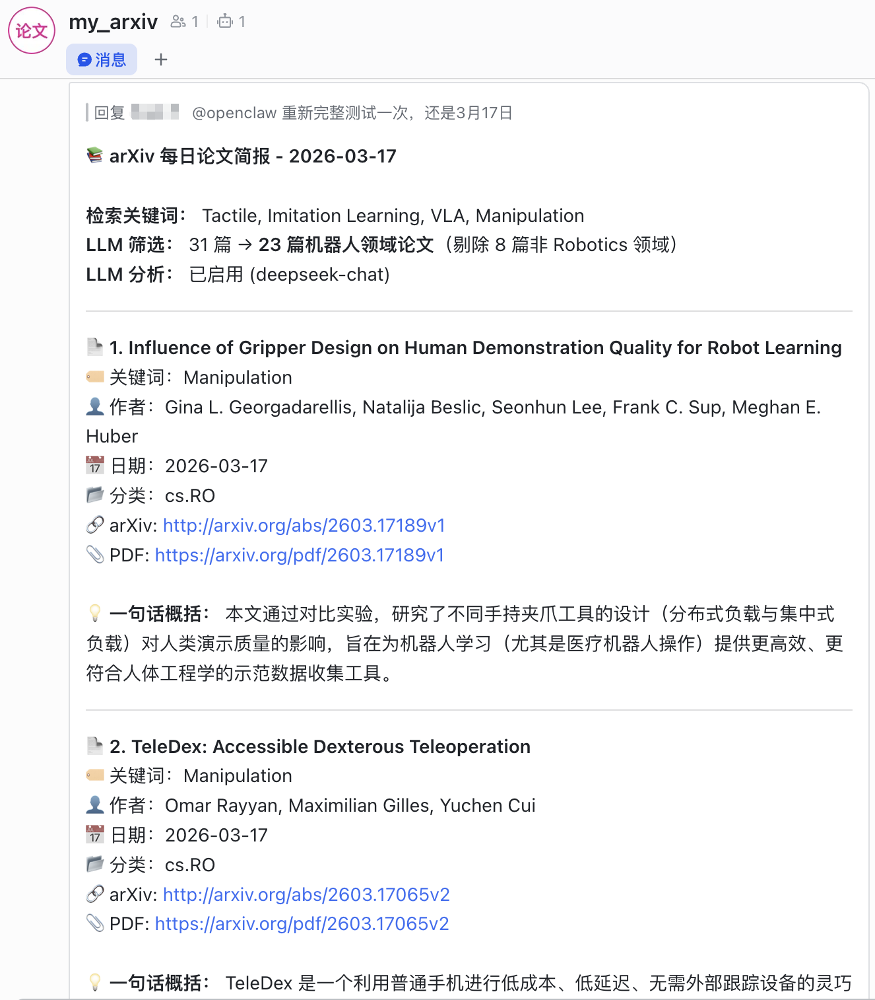

# arXiv Paper Tracker

<p align="center">
  <b>自动检索 arXiv 论文，支持关键词搜索、日期过滤、LLM 智能分析</b>
</p>

<p align="center">
  <a href="#features">Features</a> •
  <a href="#screenshots">Screenshots</a> •
  <a href="#quick-start">Quick Start</a> •
  <a href="#integration-with-openclaw">OpenClaw</a> •
  <a href="#configuration">Configuration</a> •
  <a href="#contributing">Contributing</a>
</p>

<p align="center">
  
  
  
</p>

---

**English** | [中文文档](#中文文档)

## Features

- **Keyword Search** - Search papers by keywords in titles and abstracts
- **Date Filtering** - Filter papers by submission date (default: today)
- **Keyword Highlighting** - Automatically highlight matched keywords for each paper
- **LLM Analysis** - Powered by AI to analyze papers:
  - Generate structured summaries:
    - One-sentence overview
    - Motivation
    - Method
    - Results
    - Conclusion
- **Domain Filter** - Optional filter by research domain:
  - Enable to automatically filter papers by your field
  - Supports: Robotics, NLP, Computer Vision, Reinforcement Learning, etc.
  - Disabled by default - works with LLM analysis
- **Markdown Reports** - Auto-generate beautiful Markdown reports
- **Multiple LLM Support** - Support Alibaba Bailian, DeepSeek, and other OpenAI-compatible APIs

## Screenshots

**Feishu Daily Report (via OpenClaw):**

<p align="center">
  
</p>

## Quick Start

### Prerequisites

- Python 3.10+
- API Key (optional, for LLM analysis)

### Installation

```bash
# Clone the repository
git clone https://github.com/zk-yue/arXiv-Paper-Tracker.git
cd arXiv-Paper-Tracker

# Create virtual environment
conda create -n arxiv python=3.10 -y
conda activate arxiv

# Install dependencies
pip install -r requirements.txt
```

### Configuration

```bash
# Copy example config
cp config.example.json config.json
```

Edit `config.json`:

```json
{
  "keywords": ["Deep Learning", "Transformer", "Diffusion Model", "Large Language Model"],
  "max_results": 100,
  "sort_by": "submittedDate",
  "domain_filter": {
    "enabled": false,
    "domain": "Robotics",
    "filter_out_non_domain": true
  },
  "llm": {
    "api_key": "YOUR_API_KEY",
    "api_base": "https://api.deepseek.com",
    "model": "deepseek-chat"
  }
}
```

Or set environment variable:

```bash
export LLM_API_KEY="your-api-key"
```

### Usage

```bash
# Search today's papers
python arxiv_search.py

# Search specific date
python arxiv_search.py -d 2026-03-17

# Enable LLM analysis
python arxiv_search.py -d 2026-03-17 -l

# Test mode: analyze only the first paper (save time & cost)
python arxiv_search.py -d 2026-03-17 -l -t
```

## Integration with OpenClaw

This project can be integrated with [OpenClaw](https://github.com/zk-yue/OpenClaw) to enable automated paper tracking workflows:

- **Scheduled Push** - Automatically send daily paper reports to Feishu, Discord, Telegram, etc.
- **Paper Download** - Automatically download PDF files of matched papers
- **Smart Summaries** - Generate and push AI-powered paper summaries on a schedule
- **Interactive Mode** - Users can request detailed analysis for specific papers

### Quick Setup

1. Configure your keywords in `config.json`
2. Add the job configuration to OpenClaw's `~/.openclaw/cron/jobs.json`
3. Set your notification channel (Feishu/Discord/Telegram)

For detailed setup instructions, see the **[OpenClaw Integration Guide](docs/openclaw-integration.md)**.

## Output

- `results/*.json` - JSON format results
- `results/*_report.md` - Markdown reports

### Sample Report

```markdown
# arXiv 论文检索报告

**检索日期**: 2026-03-17

**关键词**: Tactile, Imitation Learning, VLA, Manipulation

**结果数量**: 24 篇

**LLM分析**: 已启用 (deepseek-chat)

---

## 1. TeleDex: Accessible Dexterous Teleoperation

- **匹配关键词**: Manipulation
- **作者**: Omar Rayyan, Maximilian Gilles, Yuchen Cui
- **发布日期**: 2026-03-17
- **arXiv链接**: [http://arxiv.org/abs/2603.17065v2](http://arxiv.org/abs/2603.17065v2)
- **PDF链接**: [下载PDF](https://arxiv.org/pdf/2603.17065v2)
- **分类**: cs.RO

### 📝 LLM分析

## 一句话概括
TeleDex是一个利用普通手机进行低成本、低延迟、无需外部追踪设备的灵巧手与机器人遥操作系统。

## Motivation
现有的灵巧遥操作方案通常依赖昂贵且复杂的专用硬件，阻碍了在真实部署环境中快速收集演示数据。

## Method
1. **核心创新点**：完全基于智能手机的灵巧遥操作方案，无需外部追踪设备
2. **算法框架**：手机端实时传输6自由度手腕姿态和21自由度手部关节状态，重定向到机器人
3. **关键技术**：支持手持模式和3D打印固定接口模式，完全开源

## Result
在仿真和真实世界任务上验证有效，能收集高质量演示数据支持策略微调。

## Conclusion
TeleDex显著降低了灵巧遥操作的门槛，使部署环境中快速、低成本收集演示数据成为可能。
```

## Configuration

| Field | Description |
|-------|-------------|
| `keywords` | List of search keywords |
| `max_results` | Maximum number of results |
| `sort_by` | Sort order: `submittedDate` / `relevance` / `lastUpdatedDate` |
| `domain_filter.enabled` | Enable domain filtering (default: `false`) |
| `domain_filter.domain` | Target domain for filtering (e.g., `Robotics`, `NLP`, `Computer Vision`) |
| `domain_filter.filter_out_non_domain` | Filter out non-target domain papers (default: `true`) |
| `llm.api_key` | API key for LLM service |
| `llm.api_base` | API endpoint URL |
| `llm.model` | Model name |

### Domain Filter

Enable domain filtering to automatically filter papers by your research field:

```json
{
  "domain_filter": {
    "enabled": true,
    "domain": "NLP",
    "filter_out_non_domain": true
  }
}
```

Supported domains: `Robotics`, `NLP`, `Computer Vision`, `Reinforcement Learning`, etc.

## Supported LLM Providers

### Alibaba Bailian (Default)

```json
{
  "llm": {
    "api_key": "YOUR_API_KEY",
    "api_base": "https://coding.dashscope.aliyuncs.com/v1",
    "model": "qwen3.5-plus"
  }
}
```

### DeepSeek

```json
{
  "llm": {
    "api_key": "YOUR_DEEPSEEK_API_KEY",
    "api_base": "https://api.deepseek.com",
    "model": "deepseek-chat"
  }
}
```

### OpenAI

```json
{
  "llm": {
    "api_key": "YOUR_OPENAI_API_KEY",
    "api_base": "https://api.openai.com/v1",
    "model": "gpt-4o"
  }
}
```

## Scheduled Tasks

Set up daily automatic execution at 9 AM:

```bash
./install_cron.sh
```

## Project Structure

```
arXiv-Paper-Tracker/
├── arxiv_search.py      # Main program
├── config.json          # Configuration file
├── config.example.json  # Example configuration
├── requirements.txt     # Python dependencies
├── install_cron.sh      # Cron job installer
├── docs/                # Documentation
│   └── openclaw-integration.md  # OpenClaw integration guide
└── results/             # Output directory
    ├── *.json           # JSON results
    └── *_report.md      # Markdown reports
```

## Contributing

Contributions are welcome! Please feel free to submit a Pull Request.

1. Fork the repository
2. Create your feature branch (`git checkout -b feature/AmazingFeature`)
3. Commit your changes (`git commit -m 'Add some AmazingFeature'`)
4. Push to the branch (`git push origin feature/AmazingFeature`)
5. Open a Pull Request

## License

This project is licensed under the MIT License - see the [LICENSE](LICENSE) file for details.

## Acknowledgments

- [arXiv](https://arxiv.org/) - Open access to scientific papers
- [arxiv.py](https://github.com/lukasschwab/arxiv.py) - Python wrapper for arXiv API

---

# 中文文档

## 功能特性

- **关键词搜索** - 在标题和摘要中搜索关键词
- **日期过滤** - 按提交日期过滤论文（默认：当天）
- **关键词匹配** - 自动标注每篇论文匹配的关键词
- **LLM 分析** - 使用 AI 智能分析论文：
  - 生成结构化摘要：
    - 一句话概括
    - 研究动机 (Motivation)
    - 方法 (Method)
    - 实验结果 (Result)
    - 结论 (Conclusion)
- **领域过滤** - 可选，按研究领域筛选论文：
  - 启用后自动过滤非目标领域论文
  - 支持：Robotics、NLP、Computer Vision、Reinforcement Learning 等
  - 默认关闭，需配合 LLM 分析使用
- **报告生成** - 自动生成 Markdown 格式报告
- **多 LLM 支持** - 支持阿里云百炼、DeepSeek 等 OpenAI 兼容 API

## 快速开始

### 环境要求

- Python 3.10+
- API Key（可选，用于 LLM 分析）

### 安装

```bash
# 克隆仓库
git clone https://github.com/zk-yue/arXiv-Paper-Tracker.git
cd arXiv-Paper-Tracker

# 创建虚拟环境
conda create -n arxiv python=3.10 -y
conda activate arxiv

# 安装依赖
pip install -r requirements.txt
```

### 配置

```bash
# 复制配置文件模板
cp config.example.json config.json
```

编辑 `config.json`：

```json
{
  "keywords": ["Deep Learning", "Transformer", "Diffusion Model", "Large Language Model"],
  "max_results": 100,
  "sort_by": "submittedDate",
  "domain_filter": {
    "enabled": false,
    "domain": "Robotics",
    "filter_out_non_domain": true
  },
  "llm": {
    "api_key": "YOUR_API_KEY",
    "api_base": "https://api.deepseek.com",
    "model": "deepseek-chat"
  }
}
```

或设置环境变量：

```bash
export BAILIAN_API_KEY="your-api-key"
```

## 使用方法

```bash
# 检索当天论文
python arxiv_search.py

# 检索指定日期
python arxiv_search.py -d 2026-03-17

# 启用 LLM 分析（需要 API Key）
python arxiv_search.py -d 2026-03-17 -l

# 测试模式：只分析第一篇论文（省时省钱）
python arxiv_search.py -d 2026-03-17 -l -t
```

## 结合 OpenClaw 使用

本项目可与 [OpenClaw](https://github.com/zk-yue/OpenClaw) 结合，实现自动化论文追踪工作流：

- **定时推送** - 自动将每日论文报告推送到飞书、Discord、Telegram 等
- **论文下载** - 自动下载匹配论文的 PDF 文件
- **智能总结** - 按计划生成并推送 AI 驱动的论文摘要
- **交互模式** - 用户可请求特定论文的详细分析

### 快速配置

1. 在 `config.json` 中配置关键词
2. 将任务配置添加到 OpenClaw 的 `~/.openclaw/cron/jobs.json`
3. 设置通知渠道（飞书/Discord/Telegram）

详细配置说明请参考 **[OpenClaw 集成指南](docs/openclaw-integration.md)**。

## 输出文件

- `results/*.json` - JSON 格式结果
- `results/*_report.md` - Markdown 格式报告

## 配置说明

| 字段 | 说明 |
|------|------|
| `keywords` | 搜索关键词列表 |
| `max_results` | 最大返回结果数 |
| `sort_by` | 排序方式：`submittedDate` / `relevance` / `lastUpdatedDate` |
| `domain_filter.enabled` | 是否启用领域过滤（默认：`false`） |
| `domain_filter.domain` | 目标领域（如 `Robotics`、`NLP`、`Computer Vision`） |
| `domain_filter.filter_out_non_domain` | 是否过滤掉非目标领域论文（默认：`true`） |
| `llm.api_key` | API Key |
| `llm.api_base` | API 地址 |
| `llm.model` | 模型名称 |

### 领域过滤

启用领域过滤可自动筛选你研究领域的论文：

```json
{
  "domain_filter": {
    "enabled": true,
    "domain": "NLP",
    "filter_out_non_domain": true
  }
}
```

支持领域：`Robotics`、`NLP`、`Computer Vision`、`Reinforcement Learning` 等。

## 切换 LLM API

### 阿里云百炼（默认）

```json
{
  "llm": {
    "api_key": "YOUR_API_KEY",
    "api_base": "https://coding.dashscope.aliyuncs.com/v1",
    "model": "qwen3.5-plus"
  }
}
```

### DeepSeek

```json
{
  "llm": {
    "api_key": "YOUR_DEEPSEEK_API_KEY",
    "api_base": "https://api.deepseek.com",
    "model": "deepseek-chat"
  }
}
```

### OpenAI

```json
{
  "llm": {
    "api_key": "YOUR_OPENAI_API_KEY",
    "api_base": "https://api.openai.com/v1",
    "model": "gpt-4o"
  }
}
```

## 定时任务

运行以下脚本设置每天早上 9 点自动执行：

```bash
./install_cron.sh
```

## 项目结构

```
arXiv-Paper-Tracker/
├── arxiv_search.py      # 主程序
├── config.json          # 配置文件
├── config.example.json  # 配置文件模板
├── requirements.txt     # Python 依赖
├── install_cron.sh      # 定时任务安装脚本
├── docs/                # 文档
│   └── openclaw-integration.md  # OpenClaw 集成指南
└── results/             # 输出目录
    ├── *.json           # JSON 结果
    └── *_report.md      # Markdown 报告
```

## 贡献

欢迎提交 Issue 和 Pull Request！

1. Fork 本仓库
2. 创建特性分支 (`git checkout -b feature/AmazingFeature`)
3. 提交更改 (`git commit -m 'Add some AmazingFeature'`)
4. 推送到分支 (`git push origin feature/AmazingFeature`)
5. 提交 Pull Request

## 许可证

本项目采用 MIT 许可证 - 详情见 [LICENSE](LICENSE) 文件。

## 致谢

- [arXiv](https://arxiv.org/) - 开放获取学术论文
- [arxiv.py](https://github.com/lukasschwab/arxiv.py) - arXiv API Python 封装