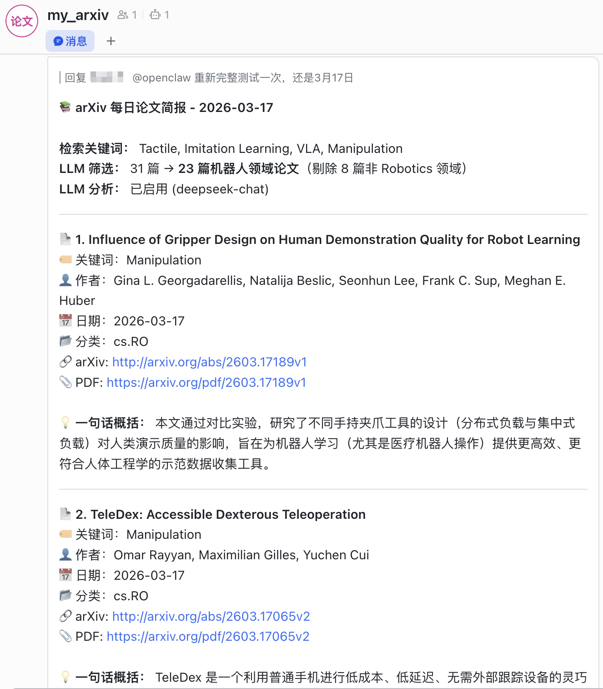

# arXiv Paper Tracker

> 関連する arXiv 論文を見つけ、報告済みの結果を除外し、必要に応じて要旨を構造化された LLM 分析に変換します。

[](https://www.python.org/)
[](../../LICENSE)
[](https://info.arxiv.org/help/api/)

[English](../../README.md) · [简体中文](README.zh-CN.md) · **日本語** · [Español](README.es.md)

arXiv Paper Tracker は、設定ファイルで動作する軽量な Python 製の文献探索ツールです。タイトルと要旨をキーワードで検索し、投稿日で絞り込み、直近のレポートとの重複を除外して、機械処理向けの JSON と読みやすい Markdown の両方を出力します。OpenAI 互換 API を接続すれば、構造化要約の生成や研究分野による絞り込みも行えます。

```text
arXiv API → 日付・キーワード照合 → 過去レポートとの重複排除 → 任意の LLM 分析 → JSON + Markdown
```



## 主な機能

- arXiv のタイトルと要旨から複数のキーワードを検索。
- 単一の投稿日、または両端を含む複数日の範囲を指定。
- 直近のローカル JSON レポートに含まれる論文を除外。
- OpenAI 互換 API で、動機・手法・結果・結論の構造化要約を生成。
- LLM で研究分野を判定し、対象分野外の論文を必要に応じて除外。
- 最大 5 件の論文を並列分析。
- 完全な JSON レコードと、arXiv・PDF リンク付き Markdown ダイジェストを出力。
- 任意の arXiv カテゴリの更新確認と、OpenClaw による定期配信に対応。

## クイックスタート

### 必要な環境

- Python 3.10 以降
- Git、および arXiv に接続できるネットワーク環境
- 任意：OpenAI 互換 Chat Completions エンドポイントの認証情報

### インストール

```bash
git clone https://github.com/zk-yue/arXiv-Paper-Tracker.git
cd arXiv-Paper-Tracker

python -m venv .venv
source .venv/bin/activate  # Windows: .venv\Scripts\activate
python -m pip install -r requirements.txt
```

### 設定

```bash
cp config.example.json config.json
```

実行前に `config.json` を編集します。

```json
{
  "keywords": ["Deep Learning", "Transformer", "Large Language Model"],
  "max_results": 100,
  "sort_by": "submittedDate",
  "save_format": "json",
  "domain_filter": {
    "enabled": false,
    "domain": "Robotics",
    "filter_out_non_domain": true
  },
  "llm": {
    "api_key": "YOUR_API_KEY",
    "api_base": "https://api.deepseek.com",
    "model": "deepseek-chat"
  }
}
```

`config.json` は Git の追跡対象外です。API キーをコミットしないでください。環境変数 `LLM_API_KEY` を使う場合は、`llm` オブジェクトから `api_key` フィールドを削除してください。このフィールドが存在すると、その値が環境変数より優先されます。

### 実行

プログラムが `config.json` と `results/` を見つけられるよう、リポジトリのルートでコマンドを実行してください。

```bash
# 今日投稿された論文を LLM 分析なしで検索
python arxiv_search.py

# 2026-06-23 とその直前 3 日を検索し、一致した論文を分析
python arxiv_search.py --date 2026-06-23 --date-range 3 --llm

# LLM 設定のテスト時に最初の 1 件だけを分析
python arxiv_search.py --date 2026-06-23 --llm --test

# Robotics カテゴリの直近 7 日間の更新を確認
python check_arxiv_update.py --category cs.RO
```

## 設定リファレンス

| フィールド | 型 | 説明 |
| --- | --- | --- |
| `keywords` | 文字列配列 | タイトルと要旨で大文字・小文字を区別せず照合する語句。 |
| `max_results` | 整数 | ローカルでの絞り込み前に arXiv へ要求する最大件数。 |
| `sort_by` | 文字列 | `submittedDate`、`relevance`、`lastUpdatedDate` のいずれか。 |
| `save_format` | 文字列 | 予約済み設定。現在の実装は常に JSON と Markdown を出力します。 |
| `domain_filter.enabled` | 真偽値 | 各論文が `domain` に属するか LLM に判定させます。`--llm` が必要です。 |
| `domain_filter.domain` | 文字列 | `Robotics`、`NLP`、`Computer Vision` などの対象分野。 |
| `domain_filter.filter_out_non_domain` | 真偽値 | LLM が対象分野外と判定した論文を除外します。 |
| `llm.api_key` | 文字列 | API 認証情報。このフィールドを削除すると `LLM_API_KEY` が使用されます。 |
| `llm.api_base` | 文字列 | `/chat/completions` を含まない OpenAI 互換 API のベース URL。 |
| `llm.model` | 文字列 | 設定したエンドポイントが受け付けるモデル識別子。 |

現在の分析プロンプトと生成レポートの見出しは、README の言語にかかわらず中国語です。エンドポイントは OpenAI 形式の `messages` を受け取る `POST {api_base}/chat/completions` に対応している必要があります。

## コマンドラインリファレンス

### 論文検索

```text
python arxiv_search.py [-d DATE] [-l] [-t]
                       [--date-range DAYS] [--dedup-days DAYS]
```

| オプション | 意味 |
| --- | --- |
| `-d, --date YYYY-MM-DD` | 検索期間の終了日。既定値は今日です。 |
| `-l, --llm` | LLM 分析を有効化します。API キーが必要です。 |
| `-t, --test` | 最初に一致した 1 件だけを分析します。`--llm` と併用する場合に有効です。 |
| `--date-range DAYS` | 指定日から遡って含める日数。`3` の場合は合計 4 日分を検索します。既定値：`0`。 |
| `--dedup-days DAYS` | 報告済み arXiv ID を探すために JSON レポートを遡る日数。既定値：`7`。 |

重複排除には、保存済み URL から取得したバージョン接尾辞付きの arXiv ID を使用します。`results/` 内で、ファイル名が `YYYYMMDD` 形式の日付から始まる JSON ファイルだけが対象です。

### 更新チェッカー

```text
python check_arxiv_update.py [-c CATEGORY] [-d DATE]
```

`--category` の既定値は `cs.RO` です。`--date` を省略すると直近 7 暦日を日ごとに確認し、指定するとその日のみを確認します。

## 出力

各実行で `results/` に次のファイルを生成します。

| パス形式 | 内容 |
| --- | --- |
| `results/YYYYMMDD_<keywords>.json` | 後続処理に使える検索メタデータと完全な論文レコード。 |
| `results/YYYY-MM-DD_report.md` | メタデータ、リンク、構造化分析または要旨の抜粋を含むダイジェスト。 |

一致する論文がなくても、空の JSON 結果と Markdown レポートを生成します。LLM の分野フィルターですべての論文が除外された場合、現在の実装では Markdown レポートを生成しません。

## 自動化と OpenClaw

[`install_cron.sh`](../../install_cron.sh) は毎日 09:00 に実行する cron エントリを登録します。実行前に内容を確認してください。このスクリプトは `~/anaconda3` にある `arxiv` という名前の Conda 環境を前提とし、`arxiv_search.py` を含む既存の crontab 行を置き換えます。環境に合わせてパス、環境名、時刻、任意の `--llm` フラグを調整してください。

Feishu、Discord、Telegram へ定期ダイジェストを配信する方法は、[OpenClaw 連携ガイド](../openclaw-integration.md)を参照してください。本ツールはローカルのレポートファイルを生成し、メッセージ配信は OpenClaw が担当します。

## プロジェクト構成

```text
arXiv-Paper-Tracker/
├── arxiv_search.py              # 検索、重複排除、LLM 分析、出力
├── check_arxiv_update.py        # カテゴリ更新チェッカー
├── config.example.json          # 安全な設定テンプレート
├── install_cron.sh              # Conda 向けの cron インストーラー
├── requirements.txt             # Python 依存パッケージ
├── docs/
│   ├── i18n/                    # 翻訳版 README
│   ├── images/demo.png          # 配信ダイジェストの例
│   └── openclaw-integration.md  # OpenClaw のスケジュール・配信ガイド
└── results/                     # ローカル生成物。Git の追跡対象外
```

## トラブルシューティング

| 症状 | 確認事項 |
| --- | --- |
| 結果がない | 日付とキーワードを確認してください。週末や祝日は新規投稿がない場合があり、インデックス作成が遅れることもあります。 |
| HTTP 429 | 時間を置いて再試行するか、広すぎるキーワードを見直し、`max_results` を減らしてください。クライアントには待機と再試行が組み込まれています。 |
| LLM 分析が省略される | `--llm` を指定し、`llm.api_key` または `LLM_API_KEY` がどのように解決されるか確認してください。 |
| LLM リクエストが失敗する | ベース URL、モデル識別子、API 互換性、利用枠、ネットワークを確認してください。分析に失敗しても論文は保持されます。 |
| 重複論文が残る | `v1` と `v2` などは別 ID として扱われます。`--dedup-days` と過去の JSON ファイル名も確認してください。 |

## コントリビューション

Issue と Pull Request を歓迎します。変更を提案する場合は、次の流れを推奨します。

1. リポジトリを Fork し、目的を絞ったブランチを作成します。
2. プログラムの挙動と 4 言語の README を一致させます。
3. `python arxiv_search.py --help` と `python check_arxiv_update.py --help` を実行し、公開 API に配慮して検索をテストします。
4. 変更の目的、挙動の変化、確認方法を記載した Pull Request を作成します。

`config.json`、生成済みレポート、認証情報、個人の配信先識別子はコミットしないでください。

## ライセンス

[MIT License](../../LICENSE) の下で公開されています。

## 謝辞

- [arXiv](https://arxiv.org/)：オープンアクセス論文と公開 API の提供。
- [arxiv.py](https://github.com/lukasschwab/arxiv.py)：Python API クライアントの提供。
- [OpenClaw](https://github.com/zk-yue/OpenClaw)：任意のスケジュール実行と複数チャネル配信。
